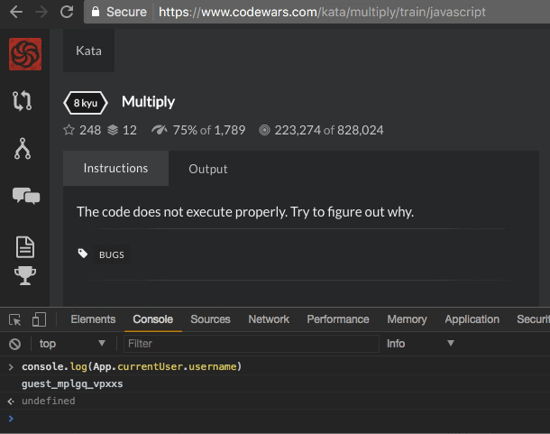

A repository filled with codewars challenges(kata).

link to my codewars: <https://www.codewars.com/users/michaelteye>
# How It's Made:
#### Tech used: JAVASCRIPT
Everyday, the first thing I do in morning is to solve a Codewar!

# Optimizations
I consistently refactor and optimize my code, sometimes for efficiency, sometimes for readability.

# Lessons Learned:
The Biggest Lesson I learned in tackling this endless supply of questions is understanding that there is a long way to go. Not being able to answer a question is okay, as long as you take the initiative to improve.